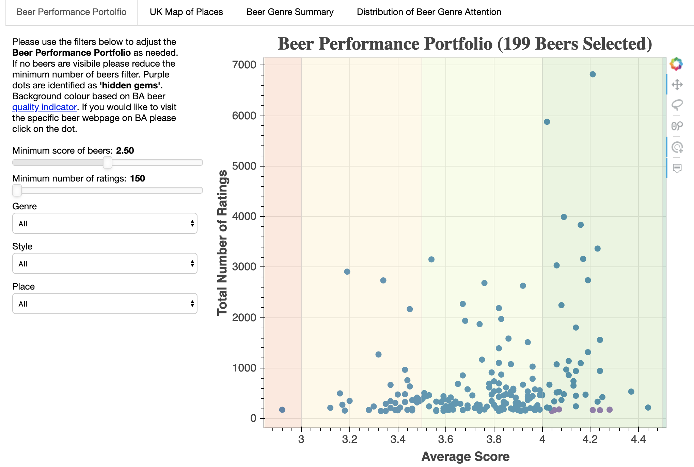
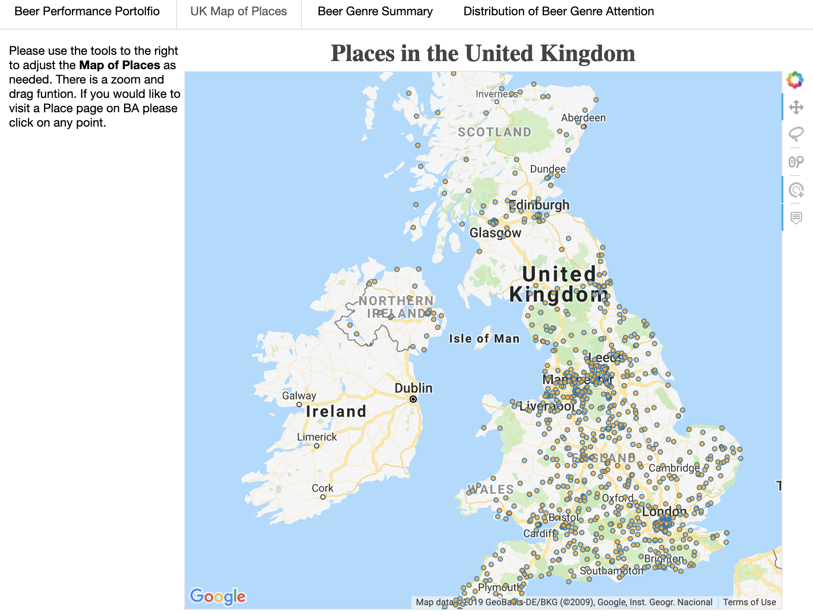

# Bokeh-App

A BeerAdvocate Bokeh-App project has been developed for the use of BeerAdvocate to help summarise and showcase the vast amount of data the platform has. 

See the BeerAdvocate Website for more information on the website.

You will need to add in your own Google API Key to use the map functionality in gmap_map.py under bokeh-app/scripts

Requirements:
* Python 3.6 (may work on other versions but has not been tested)
* bokeh 0.12.16 (bokeh is a work in progress so subsequents update may break functionality. I will try to update as I can.)

The main application is located in the `bokeh_app` folder. To run the application,
open a command prompt, change to the directory containing `bokeh_app` and run
`bokeh serve --show bokeh_app/`. This runs a bokeh server locally
and will automatically open the interactive dashboard in your browser at localhost:5006. 

Any comments, suggestions, improvements are greatly appreciated!

Credit: Will Koehrsen 
Link: https://towardsdatascience.com/data-visualization-with-bokeh-in-python-part-iii-a-complete-dashboard-dc6a86aa6e23
